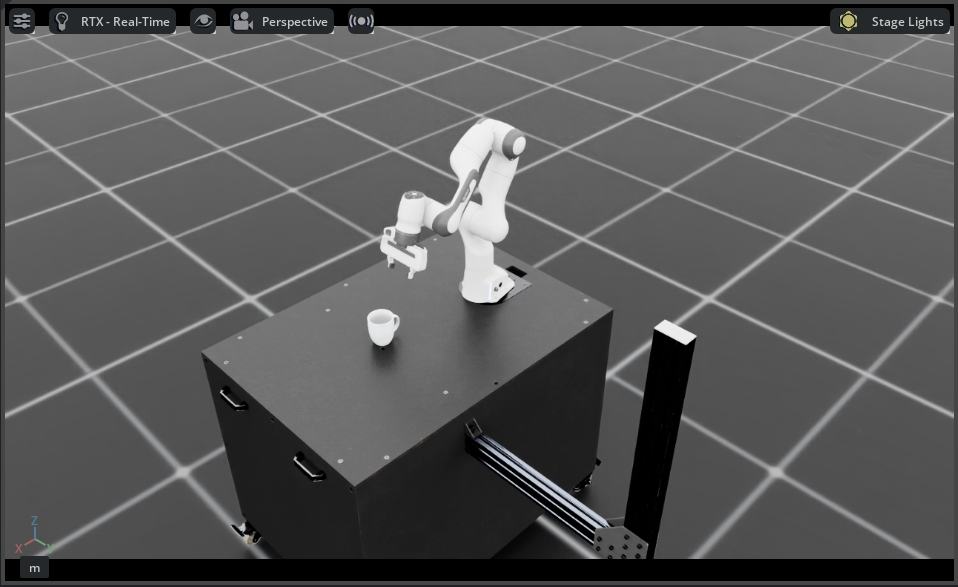
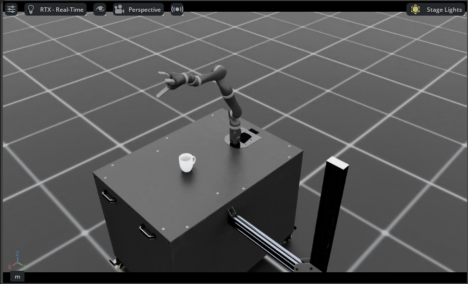
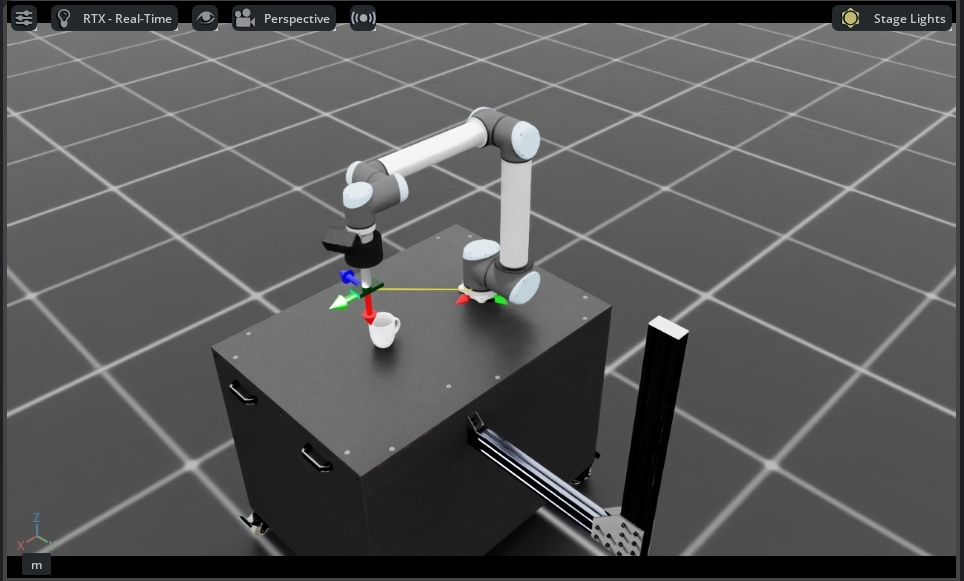
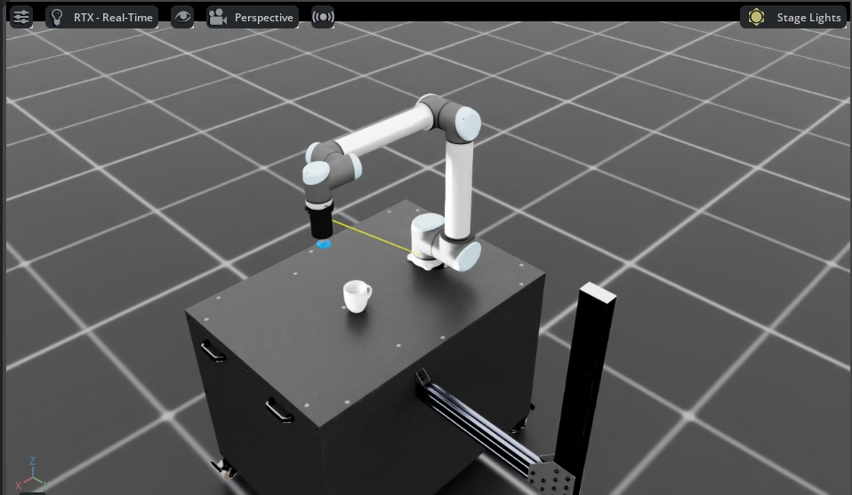

# Grasp with Complex Trajectory Benchmark

This repository provides a benchmark and toolkit for collecting and evaluating robotic grasping demonstrations with complex trajectories using **Isaac Lab**.

---

## 🐳 Docker Quick Start (Recommended)

We provide a pre-configured Docker environment to simplify setup and ensure reproducibility. This is the **recommended** way to run the benchmark.

### 1. Prerequisites
Ensure you have the following installed on your host machine:
* **NVIDIA Driver**
* [**Docker** & **NVIDIA Container Toolkit**](https://docs.nvidia.com/datacenter/cloud-native/container-toolkit/latest/install-guide.html)
* Pull the official Isaac Lab base image:
  ```bash
  docker pull nvcr.io/nvidia/isaac-lab:2.3.0
  ```

### 2. Clone Repository
Clone the repository to your local machine:

```bash
git clone https://github.com/airvlab/MultiGripper_Grasping_isaaclab.git
cd MultiGripper_Grasping_isaaclab
```

### 3. Download Assets
Download asset usd files [objects_usd_fixed_density.zip](https://utdallas.app.box.com/v/multi-gripper-grasp-data) from [MultiGripperGrasp Toolkit](https://irvlutd.github.io/MultiGripperGrasp/).
Extract the contents into the `/models/objects_MG` folder inside this project.

### 4. Run
We provide a helper script `run.sh` to automatically build the environment and mount your workspace.

```bash
# Grant execution permission
chmod +x run.sh

# Launch the container
./run.sh
```

> **Note:** If you encounter a `permission denied` error (e.g., related to Docker daemon socket), please try running with sudo:
> ```bash
> sudo ./run.sh
> ```

Once inside the container terminal, you can run the tasks immediately:

```bash
# Example: Record demonstrations using keyboard
python record_demos_new.py --teleop_device keyboard --num_demos 10 --task_id a01
```

---

## 📦 Local Installation (Alternative)

If you prefer to run the environment locally without Docker, follow these steps.

### 1. Install Isaac Lab
Install the Isaac Lab main version by following the [installation guide](https://isaac-sim.github.io/IsaacLab/main/source/setup/installation/index.html) with **Isaac Sim 5.1.0**.

### 2. Clone the Repository
Clone this repository outside the IsaacLab directory:

```bash
git clone https://github.com/airvlab/MultiGripper_Grasping_isaaclab.git
```

### 3. Activate Environment
Use a Python interpreter that has Isaac Lab installed:

```bash
conda activate env_isaaclab
```

### 4. Download Assets
(If you haven't done this in the Docker step above)
Download asset usd files [objects_usd_fixed_density.zip](https://utdallas.app.box.com/v/multi-gripper-grasp-data) from [MultiGripperGrasp Toolkit](https://irvlutd.github.io/MultiGripperGrasp/).
Extract the contents into the `/models/objects_MG` folder.

---

## 🤖 Robot Status & Availability

This benchmark currently supports four robot configurations. Please note their current status before collecting data:

* ✅ **Tested & Ready:**
    * **Franka Emika**
    * **UR10 (Short Suction)**
    <br>These robots have been fully tested and are recommended for data collection tasks.

* ⚠️ **Experimental:**
    * **Kinova Gen3**
    * **UR10 (Long Suction)**
    <br>These configurations are currently less stable and may not perform optimally.

---

## 🛠️ Task Design and Data Collection

### 1. Creating Custom Tasks
Tasks are configured in `tasks/config.yaml`. Each task requires a unique ID and defines object pose relative to the table center (base pose).

### 2. To collect the data, run:

**Option A: Using SpaceMouse (Default)**
```bash
python record_demos_new.py --teleop_device spacemouse --num_demos 10 --task_id a01
```

**Option B: Using Keyboard**
```bash
python record_demos_new.py --teleop_device keyboard --num_demos 10 --task_id a01
```

> **How to change the teleoperation device:**
> simply modify the `--teleop_device` argument in the command line.
> * **Available options:** `spacemouse`, `keyboard`, `gamepad`, `handtracking`.

### 3. To replay the data, run:
```bash
python replay_demos.py --dataset_file ./datasets/a01_o1_d3.hdf5
```

---

## ⚙️ Configuration Guide

### 1. Switching Robots (Mechanical Arm)
The repository supports four distinct robot configurations. To switch between them, you need to modify the `record_demos_new.py` file directly.

1. Open `record_demos_new.py`.
2. Locate the `parser.add_argument("--task", ...)` section (approx. lines 38-42).
3. Comment out the current task and uncomment the desired robot configuration.

| Robot Type | Task ID (Config Name) | Preview |
| :--- | :--- | :---: |
| **Franka Emika** <br> *(Default)* | `Grasp-Franka-IK-Rel-img` |  |
| **Kinova Gen3** | `Grasp-Kinova-J2N75300-IK-Rel-img` |  |
| **UR10** <br> *(Long Suction)* | `Grasp-UR10-Long-Suction-IK-Rel-img` |  |
| **UR10** <br> *(Short Suction)* | `Grasp-UR10-Short-Suction-IK-Rel-img` |  |

**Example Modification:**
To use the UR10 with Short Suction, your code should look like this:

```python
# parser.add_argument("--task", type=str, default= 'Grasp-Franka-IK-Rel-img', help="Name of the task.")
parser.add_argument("--task", type=str, default= 'Grasp-UR10-Short-Suction-IK-Rel-img', help="Name of the task.")
```

> [!WARNING]
> **Important Note for Suction Grippers:**
> If you are using **UR10 Suction tasks**, the physics simulation requires the CPU pipeline for stability. Please ensure the device is set to `cpu`.

### 2. Simulation Device (CPU vs GPU)
The simulation backend can be configured to run on CPU or GPU.
* **For Suction Tasks:** You **must** use the CPU pipeline (`args_cli.device = "cpu"`).
* **For Gripper Tasks:** If you wish to use the GPU for faster simulation, please change `args_cli.device = "cpu"` in `record_demos_new.py`.

---

## 🎮 Supported Input Devices

- **Keyboard**: WASD and arrow keys for control
- **Spacemouse**: 6DOF 3D mouse for precise manipulation
- **Gamepad**: Xbox controller or similar with dual joysticks
- **OpenXR**: Hand tracking using index/thumb tip averaging with pinch-to-grip

For detailed device configuration, see the [IsaacLab device documentation](https://isaac-sim.github.io/IsaacLab/main/source/api/lab/isaaclab.devices.html#device-base) and [teleoperation guide](https://isaac-sim.github.io/IsaacLab/main/source/overview/teleop_imitation.html#teleoperation).

---

## 💡 Configuration Tips

- **Positioning**: `pos` and `rot` values are relative to the base pose (table center).
- **Stacking**: Use `diff` parameter to offset objects for tight stacking based on object dimensions.
- **Balance Tasks**: Place the primary grasp target object **first** in the configuration list.

---

## 📄 License

[License Information Here]